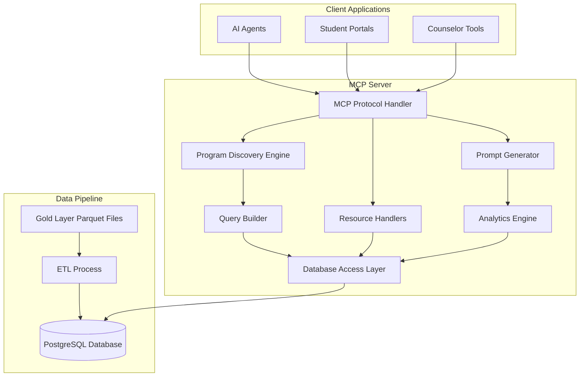

# Design Document

## Overview

The Student Recommendation MCP Server is a Python-based Model Context Protocol server that serves as a Program Discovery Assistant for educational programs. The server leverages pre-aggregated analytics stored in PostgreSQL to help students, counselors, and AI agents discover and evaluate study programs based on preferences and engagement metrics.

The architecture emphasizes performance through PostgreSQL's native querying capabilities, intelligent caching, and optimized data access patterns. The system reads from existing Parquet files in the gold layer and loads them into a normalized PostgreSQL database for efficient querying and recommendations.

## Architecture

### High-Level Architecture



### Component Architecture

The server follows a layered architecture optimized for program discovery and recommendation:

- **MCP Protocol Layer**: Handles MCP message parsing, validation, and response formatting
- **Program Discovery Layer**: Implements intelligent program search, filtering, and ranking
- **Analytics Layer**: Provides insights and statistics from the educational data
- **Data Access Layer**: Manages PostgreSQL connections, query optimization, and caching
- **Database Layer**: PostgreSQL with normalized schema and optimized indexes

## Database Schema

Based on the implemented notebooks, the database uses a normalized relational schema:

### Countries Table
```sql
CREATE TABLE countries (
    country_id SERIAL PRIMARY KEY,
    institute_country TEXT NOT NULL UNIQUE,
    num_institutes INT DEFAULT 0,
    total_programs INT DEFAULT 0,
    avg_ctr NUMERIC(5,2) DEFAULT 0.00,
    total_views BIGINT DEFAULT 0,
    total_impressions BIGINT DEFAULT 0,
    top_programs JSONB,
    created_at TIMESTAMP DEFAULT CURRENT_TIMESTAMP,
    updated_at TIMESTAMP DEFAULT CURRENT_TIMESTAMP
);
```

### Institutions Table
```sql
CREATE TABLE institutions (
    institution_id SERIAL PRIMARY KEY,
    institution_name TEXT NOT NULL,
    country_id INT REFERENCES countries(country_id) ON DELETE CASCADE,
    institution_type TEXT,
    ctr NUMERIC(5,2) DEFAULT 0.00,
    total_views BIGINT DEFAULT 0,
    total_impressions BIGINT DEFAULT 0,
    created_at TIMESTAMP DEFAULT CURRENT_TIMESTAMP,
    updated_at TIMESTAMP DEFAULT CURRENT_TIMESTAMP
);
```

### Programs Table
```sql
CREATE TABLE programs (
    program_id SERIAL PRIMARY KEY,
    program_name TEXT NOT NULL,
    institution_id INT REFERENCES institutions(institution_id) ON DELETE CASCADE,
    country_id INT REFERENCES countries(country_id) ON DELETE CASCADE,
    duration_months INT,
    tuition NUMERIC(12,2),
    ctr NUMERIC(5,2) DEFAULT 0.00,
    total_views BIGINT DEFAULT 0,
    total_impressions BIGINT DEFAULT 0,
    created_at TIMESTAMP DEFAULT CURRENT_TIMESTAMP,
    updated_at TIMESTAMP DEFAULT CURRENT_TIMESTAMP
);
```

### Indexes for Performance
```sql
-- Country indexes
CREATE INDEX idx_countries_ctr ON countries(avg_ctr DESC);
CREATE INDEX idx_countries_programs ON countries(total_programs DESC);

-- Institution indexes
CREATE INDEX idx_institutions_ctr ON institutions(ctr DESC);
CREATE INDEX idx_institutions_country ON institutions(country_id);
CREATE INDEX idx_institutions_type ON institutions(institution_type);

-- Program indexes
CREATE INDEX idx_programs_ctr ON programs(ctr DESC);
CREATE INDEX idx_programs_country ON programs(country_id);
CREATE INDEX idx_programs_institution ON programs(institution_id);
CREATE INDEX idx_programs_duration ON programs(duration_months);
CREATE INDEX idx_programs_tuition ON programs(tuition);
```

## Components and Interfaces

### 1. Data Loading Pipeline

**Purpose**: ETL process to load Parquet data into PostgreSQL

**Implementation Details** (from notebooks):
- Loads country, institution, and program data from specific Parquet files
- Handles data type conversions and JSON serialization for complex fields
- Implements foreign key mapping between countries, institutions, and programs
- Uses batch inserts with conflict resolution for data updates

**Key Methods**:
```python
def load_country_data(parquet_path: str) -> pd.DataFrame
def load_institution_data(parquet_path: str) -> pd.DataFrame  
def load_program_data(parquet_path: str) -> pd.DataFrame
def insert_countries(df: pd.DataFrame, conn: psycopg2.Connection)
def insert_institutions(df: pd.DataFrame, conn: psycopg2.Connection)
def insert_programs(df: pd.DataFrame, conn: psycopg2.Connection)
```

### 2. Program Discovery Engine

**Purpose**: Core business logic for program search, filtering, and ranking

**Interfaces**:
```python
class ProgramDiscoveryEngine:
    def search_programs(
        self,
        country: Optional[str] = None,
        institution_type: Optional[str] = None,
        max_tuition: Optional[float] = None,
        duration_range: Optional[Tuple[int, int]] = None,
        limit: int = 20
    ) -> List[ProgramResult]
    
    def rank_programs_by_engagement(
        self, 
        programs: List[Program],
        weight_ctr: float = 0.4,
        weight_views: float = 0.3,
        weight_cost: float = 0.3
    ) -> List[RankedProgram]
    
    def get_program_recommendations(
        self,
        user_preferences: Dict[str, Any]
    ) -> List[ProgramRecommendation]
```

### 3. Database Access Layer

**Purpose**: Manages PostgreSQL connections, query execution, and data mapping

**Implementation Details** (from notebooks):
- Uses psycopg2 for PostgreSQL connectivity
- Implements connection pooling and environment-based configuration
- Handles complex data types (JSONB, arrays) and foreign key relationships
- Provides query builders for dynamic filtering and sorting

**Key Components**:
```python
class DatabaseManager:
    def __init__(self, connection_params: Dict[str, str])
    def get_connection(self) -> psycopg2.Connection
    def execute_query(self, query: str, params: Dict) -> List[Dict]
    def execute_batch(self, query: str, data: List[Dict]) -> None
    
class QueryBuilder:
    def build_program_search_query(self, filters: Dict) -> Tuple[str, Dict]
    def build_analytics_query(self, metric_type: str) -> str
    def build_ranking_query(self, criteria: Dict) -> str
```

### 4. MCP Protocol Handlers

**Purpose**: Implement MCP tools, resources, and prompts for program discovery

**Tools**:
- `search_programs`: Advanced program search with multiple filters
- `rank_programs`: Score and rank programs based on engagement and preferences
- `get_analytics`: Retrieve statistics and insights from the dataset
- `compare_programs`: Side-by-side comparison of selected programs

**Resources**:
- `programs`: Paginated access to program data with filtering
- `institutions`: Institution data with country relationships
- `countries`: Country-level analytics and program summaries

**Prompts**:
- Program recommendation templates
- Comparison summaries
- Analytics interpretation guides

### 5. Analytics Engine

**Purpose**: Generate insights and statistics from the educational data

**Capabilities**:
- Country-level program distribution and engagement metrics
- Institution rankings by type and performance
- Tuition analysis by region and program duration
- Trend analysis and comparative statistics

## Data Models

### Core Data Models

```python
@dataclass
class Country:
    country_id: int
    name: str
    num_institutes: int
    total_programs: int
    avg_ctr: float
    total_views: int
    total_impressions: int
    top_programs: List[Dict[str, Any]]

@dataclass
class Institution:
    institution_id: int
    name: str
    country_id: int
    country_name: str
    institution_type: str
    ctr: float
    total_views: int
    total_impressions: int

@dataclass
class Program:
    program_id: int
    name: str
    institution_id: int
    institution_name: str
    country_id: int
    country_name: str
    duration_months: int
    tuition: Optional[float]
    ctr: float
    total_views: int
    total_impressions: int

@dataclass
class ProgramRecommendation:
    program: Program
    score: float
    ranking_factors: Dict[str, float]
    recommendation_reason: str
```

### MCP Response Models

```python
@dataclass
class SearchResult:
    programs: List[Program]
    total_count: int
    filters_applied: Dict[str, Any]
    execution_time_ms: int

@dataclass
class AnalyticsResult:
    metric_type: str
    data: Dict[str, Any]
    generated_at: datetime
    data_freshness: datetime
```

## Data Loading Strategy

Based on the notebook implementations:

### 1. Parquet File Processing
- **Country Data**: Loads from `gold_country_program_summary` with JSON handling for top_programs
- **Institution Data**: Loads from `gold_institute_engagement` with country mapping
- **Program Data**: Loads from `gold_program_engagement` with institution and country relationships

### 2. Data Transformation
- Converts numpy arrays to Python lists for JSON serialization
- Maps string-based foreign keys to integer IDs
- Handles missing data and creates new country/institution records as needed
- Implements data validation and type conversion

### 3. Database Loading
- Uses batch inserts with `execute_batch` for performance
- Implements upsert logic with `ON CONFLICT` clauses
- Maintains referential integrity through proper foreign key handling
- Includes timestamp tracking for data freshness

## Error Handling

### Database Connection Management
- Connection pooling with automatic retry for transient failures
- Environment-based configuration with validation
- Graceful degradation when database is unavailable
- Transaction rollback on data loading errors

### Data Quality Assurance
- Schema validation during Parquet loading
- Foreign key constraint handling with automatic relationship creation
- Data type validation and conversion error handling
- Duplicate detection and resolution strategies

## Performance Optimization

### Query Performance
- Optimized indexes on frequently filtered columns (country, institution_type, tuition, duration)
- Composite indexes for common query patterns
- JSONB indexing for top_programs searches
- Query plan analysis and optimization

### Caching Strategy
- In-memory caching for frequently accessed country and institution data
- Query result caching for common search patterns
- Cache invalidation on data updates
- Redis integration for distributed caching (future enhancement)

### Data Loading Performance
- Batch processing for large datasets
- Parallel loading of independent data sources
- Incremental updates for changed records only
- Connection pooling for concurrent operations

## Testing Strategy

### Data Pipeline Testing
- Unit tests for Parquet loading and transformation functions
- Integration tests with sample data from actual gold layer files
- Data quality validation tests
- Performance benchmarks for loading operations

### MCP Server Testing
- Protocol compliance testing against MCP specification
- End-to-end testing with real database connections
- Load testing for concurrent user scenarios
- Error handling and recovery testing

### Database Testing
- Schema migration testing
- Query performance testing with realistic data volumes
- Foreign key constraint validation
- Data integrity testing across all operations